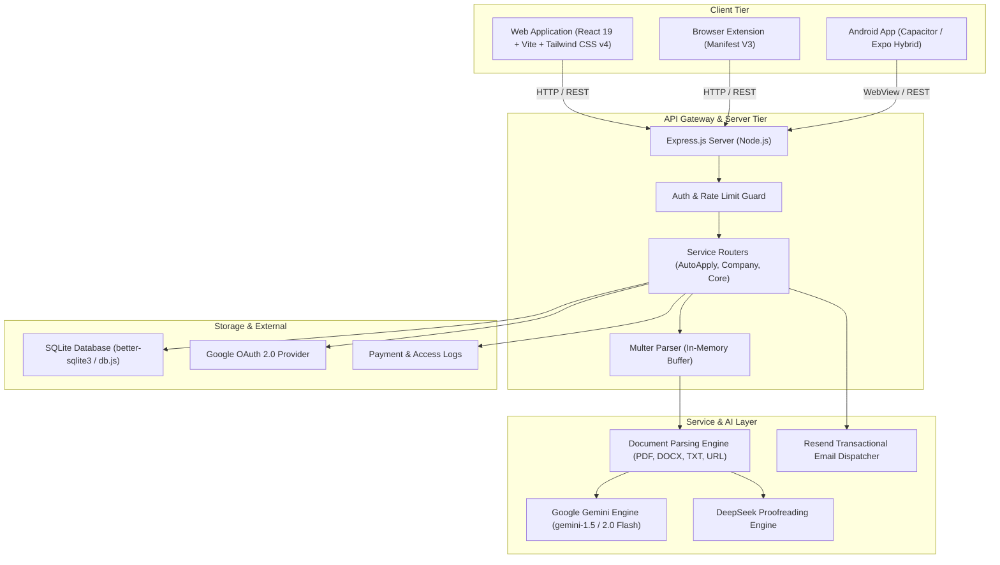
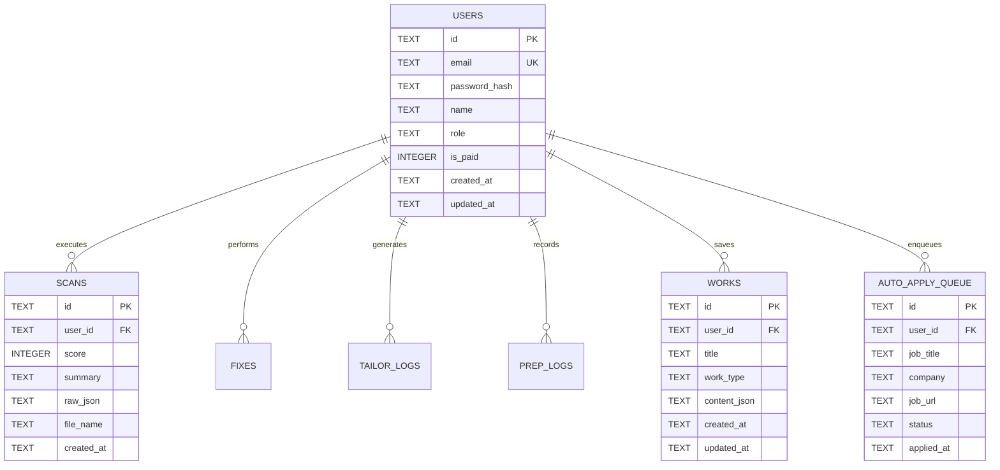

# CVMind-AI — Comprehensive Design & Architecture Specification (`design.md`)

> **Product**: CVMind-AI (AI Resume Checker & Career Acceleration Platform)  
> **Version**: 1.0.0  
> **Author**: Manav Tiwari  
> **Domain**: [https://www.cvmind.online](https://www.cvmind.online)  
> **Repository**: `manavtiwari1/CVMind-AI`  

---

## 1. Executive Summary & Vision

**CVMind-AI** is an all-in-one, enterprise-grade, AI-driven career suite designed to maximize job seekers' interview conversion rates and optimize recruiter workflows. The platform bridges the gap between candidate resumes and modern Applicant Tracking Systems (ATS) by providing instant recruiter-level scoring, real-time AI bullet optimization, job-specific tailoring, automated mock interviews, LinkedIn branding tools, portfolio generation, and an automated job application engine.

### Core Value Propositions
- **Recruiter-Grade ATS Auditing**: Scans resumes against 30+ ATS parameters (formatting, parsing safety, keyword density, STAR/XYZ metric quantification, section architecture).
- **One-Click AI Optimization**: Transforms passive bullet points into high-impact, quantifiable achievements using LLMs (Google Gemini 1.5/2.0 Flash & DeepSeek).
- **Job Tailoring Engine**: Contextually alters resumes to align with specific job descriptions, highlighting matching competencies and bridging skill gaps.
- **AI Career Ecosystem**: Includes SmartPrep interview coaching, VoicePrep interactive mock interviews, LinkedIn profile enhancers, career roadmaps, portfolio generation, and automated job dispatching.
- **Hybrid Multi-Platform Experience**: Available as a responsive web app (React 19 + Vite), an Android app (via Capacitor & Expo), and a browser extension for seamless job board integration.

---

## 2. System Architecture

CVMind-AI employs a modern, decoupled client-server architecture with high responsiveness, structured JSON contracts, and local/cloud persistence.



---

## 3. Technology Stack

| Layer | Technologies / Libraries | Purpose & Key Highlights |
| :--- | :--- | :--- |
| **Frontend Framework** | React 19, TypeScript, Vite 8 | Ultra-fast HMR, strict type safety, modern concurrent rendering. |
| **Styling & Design** | Tailwind CSS v4, Vanilla CSS Custom Properties | Light-first Enhancv/Apple aesthetic, dynamic dark mode, glassmorphism tokens. |
| **Animation & Motion** | Framer Motion 12, Canvas Confetti | Smooth spring transitions, card hover physics, scan progress rings, celebratory triggers. |
| **UI Components & Icons**| Lucide React, Radix UI Slot, Base UI | Accessible, clean primitive components and iconography. |
| **Data Visualization** | Recharts 3.x | ATS score breakdown radars, category score bars, analytics gauges. |
| **Document Generation** | `docx`, `file-saver` | Client-side export of optimized resumes and cover letters. |
| **Mobile & Hybrid** | Capacitor 8.4, Expo 56, React Native Web | Seamless Android APK packaging and mobile WebView bridge. |
| **Backend Runtime** | Node.js, Express.js | High-throughput REST API with CORS and Multer middleware. |
| **AI & LLM Services** | Google Gemini (1.5-Flash / 2.0), DeepSeek | Resume evaluation, prompt engineering with structured JSON schemas. |
| **Persistence** | SQLite (`better-sqlite3`) | Fast embedded database with structured schema, indexing, and WAL mode. |
| **Auth & Security** | Google OAuth 2.0 (`google-auth-library`), Bcrypt.js | Secure password hashing, token validation, BYOK custom API keys. |
| **Email Service** | Resend API | Beautiful HTML transactional onboarding & welcome emails. |

---

## 4. UI/UX Design System & Aesthetics

CVMind-AI implements a **Light-first, Apple & Enhancv-inspired** design language featuring clean typography, glassmorphism surfaces, subtle glow gradients, and snappy micro-interactions.

### 4.1 Color Palette & Tokens

```css
/* Core Design Tokens (Light Theme Default) */
:root {
  --bg-primary:     #ffffff;
  --bg-secondary:   #f9fafb;
  --bg-elevated:    #ffffff;
  --bg-card:        rgba(0, 0, 0, 0.02);
  --bg-input:       #f9fafb;

  --border:         #e5e7eb;
  --border-strong:  #d1d5db;
  --border-focus:   rgba(45, 192, 141, 0.6);

  --text-primary:   #0d0d0d;
  --text-secondary: #374151;
  --text-tertiary:  #6b7280;
  --text-link:      #2dc08d;

  /* Vibrant Accents */
  --blue:           #2997ff;
  --blue-dim:       rgba(41, 151, 255, 0.1);
  --purple:         #7c3aed;
  --purple-dim:     rgba(124, 58, 237, 0.08);
  --green:          #2dc08d;
  --green-dim:      rgba(45, 192, 141, 0.08);
  --red:            #ef4444;
  --orange:         #f59e0b;

  /* Signature Gradients */
  --gradient-brand:  linear-gradient(135deg, #7c3aed 0%, #2dc08d 100%);
  --gradient-subtle: linear-gradient(135deg, rgba(124,58,237,0.06) 0%, rgba(45,192,141,0.06) 100%);
  --gradient-text:   linear-gradient(135deg, #0d0d0d 0%, #7c3aed 50%, #2dc08d 100%);

  /* Glassmorphism & Elevation */
  --glass-bg:     rgba(255, 255, 255, 0.92);
  --glass-blur:   blur(16px) saturate(140%);
  --shadow-sm:    0 1px 3px rgba(0,0,0,0.06), 0 1px 2px rgba(0,0,0,0.04);
  --shadow-md:    0 4px 16px rgba(0,0,0,0.08), 0 2px 6px rgba(0,0,0,0.04);
  --shadow-lg:    0 20px 60px rgba(0,0,0,0.1), 0 4px 16px rgba(0,0,0,0.06);
  --shadow-glow:  0 0 40px rgba(45,192,141,0.12);

  /* Radius Scales */
  --radius-sm: 8px;
  --radius-md: 14px;
  --radius-lg: 22px;
  --radius-xl: 32px;
}
```

### 4.2 Typography Hierarchy
- **Primary Typeface**: [Inter](https://fonts.google.com/specimen/Inter) (`100` to `900` optical size variable font).
- **Headings**: Tight tracking (`letter-spacing: -0.02em`), heavy font weights (`700` to `800`), gradient clipping for hero titles.
- **Labels & Badges**: Uppercase micro-copy (`font-size: 0.75rem`, `font-weight: 600`, `letter-spacing: 0.05em`).
- **Body**: High legibility with `1.6` line-height for long-form suggestions and audit cards.

### 4.3 Interactive Principles & Motion
1. **Instant Feedback**: Upload drops trigger magnetic hover cues, file validation spinners, and animated multi-step scan stages.
2. **Apple-style Physics**: Smooth bezier curves `cubic-bezier(0.42, 0, 0.58, 1)` and spring rebounds.
3. **Contextual Confetti**: High ATS scores (>80) trigger canvas confetti bursts.
4. **Skeleton Screens**: Content loading states use shimmering skeletons matching card layouts to minimize layout shifts.

---

## 5. Functional Module Breakdown

```
┌────────────────────────────────────────────────────────────────────────────┐
│                              CVMind-AI Platform                            │
├──────────────────┬──────────────────┬──────────────────┬───────────────────┤
│  Resume Suite    │  Job Acquisition │  Interview Prep  │ Career & Branding │
├──────────────────┼──────────────────┼──────────────────┼───────────────────┤
│ • ATS Scanner    │ • Job Tailoring  │ • SmartPrep AI   │ • LinkedIn Suite  │
│ • Score Breakdown│ • AutoApply Hub  │ • VoicePrep Mic  │ • Career Roadmap  │
│ • AI Bullet Fix  │ • Job Finder     │ • Answer Scoring │ • Elevator Pitch  │
│ • Resume Builder │ • Company Portal │ • Rubric Advice  │ • Portfolio Gen   │
│ • Proofreading   │ • Cover Letter   │ • Speech-to-Text │ • Career Courses  │
└──────────────────┴──────────────────┴──────────────────┴───────────────────┘
```

### 5.1 Resume ATS Scanner & Scorecard (`/home`)
- **Multi-Format Ingestion**: Supports `.pdf`, `.docx`, `.txt`, and direct resume URL fetching.
- **Evaluation Engine**:
  - **Overall Score (0-100)**: Composite index calculated from 5 sub-dimensions:
    1. *Structure & Layout* (ATS parseability, clear sections).
    2. *Action Verbs & Impact* (STAR/XYZ metric adherence).
    3. *Keyword Alignment* (Industry terminology & density).
    4. *Brevity & Conciseness* (Filler word elimination).
    5. *Formatting Integrity* (Font, table, column risks).
  - **Issue Categorization**: Classified into *Critical* (Red), *Warning* (Orange), and *Good/Optimized* (Green).
  - **Keyword Cloud**: Identifies hard skills, soft skills, and missing recruiter keywords.

### 5.2 Resume Optimizer & AI Fixer (`/home`, `/resume-builder`)
- **One-Click Enhancement**: Identifies weak resume lines and generates 3 optimized alternatives with quantified impact.
- **Tone Customization**: Allows tuning outputs (Executive, Technical, Modern, Concise).
- **Live Resume Builder**: Interactive web builder allowing drag-and-drop section reordering, real-time ATS preview, and instant `.docx` / `.pdf` export.

### 5.3 Job Description Tailoring (`/tailor`)
- Compares user's resume text against a target Job Description (JD).
- Generates a **Match Percentage**, identifies missing qualifications, and provides a tailored summary and bullet points mapped to JD requirements.

### 5.4 SmartPrep & VoicePrep Interview Coach (`/prep`, `/voice-prep`)
- **Dynamic Question Generator**: Generates customized behavioral, situational, and technical interview questions based on the candidate's resume and job title.
- **Voice-Enabled Simulation**: Leverages the browser Web Speech API for real-time speech-to-text voice answering.
- **AI Answer Evaluation**: Analyzes user responses against standard evaluation rubrics, returning constructive feedback, missing points, and sample high-scoring answers.

### 5.5 LinkedIn Optimization Suite (`/linkedin`, `/linkedin-bio`, `/linkedin-outreach`, `/linkedin-post`)
- **Profile Auditor**: Reviews headlines, summary sections, and experience entries for recruiter visibility.
- **Bio Generator**: Generates compelling "About Me" narratives tailored to career milestones.
- **Outreach Generator**: Crafts high-conversion cold messages for recruiters, hiring managers, and alumni.
- **Viral Post Creator**: Creates engaging LinkedIn thought leadership posts based on topics and achievements.

### 5.6 AutoApply & Automation Engine (`/auto-apply`, `/backend/src/automation`)
- Intelligent automation dispatch system that queues, tracks, and manages job applications across supported boards and company career portals.
- Tracks application pipeline statuses (`Pending`, `Applied`, `Interviewing`, `Rejected`).

### 5.7 Portfolio & Shareable Hosted Page (`/portfolio-gen`, `/portfolio/:id`)
- Generates clean, responsive web developer / designer / professional portfolios directly from parsed resume JSON.
- Provides unique, shareable public links (`cvmind.online/portfolio/<userId>`).

### 5.8 Admin Management & Analytics (`/admin`)
- Real-time telemetry dashboard monitoring total scans, user registrations, AI token usage, whitelist management, auto-apply authorization, and system health.

---

## 6. Data Schema & Persistence (SQLite Architecture)

The backend uses SQLite (`better-sqlite3`) for zero-latency relational persistence.



---

## 7. API Routing & Endpoints Specification

### 7.1 Core Resume & AI Endpoints
| Method | Endpoint | Description | Auth / Headers |
| :--- | :--- | :--- | :--- |
| `POST` | `/api/scan` | Uploads resume (PDF/DOCX/TXT/Link), returns complete ATS evaluation JSON | Optional Gemini Key |
| `POST` | `/api/fix` | Rewrites bullet points to STAR/XYZ format | Optional Gemini Key |
| `POST` | `/api/tailor` | Compares resume text with JD and returns tailored adaptations | Optional Gemini Key |
| `POST` | `/api/prep` | Generates role-tailored interview questions and rubrics | Optional Gemini Key |
| `POST` | `/api/prep/evaluate` | Evaluates user's transcribed or typed interview answer | Optional Gemini Key |
| `POST` | `/api/proofread` | Grammar, spelling, and structural proofreading (DeepSeek) | Optional Gemini Key |
| `POST` | `/api/cover-letter` | Generates tailored cover letter from resume & job details | Optional Gemini Key |

### 7.2 LinkedIn & Career Endpoints
| Method | Endpoint | Description |
| :--- | :--- | :--- |
| `POST` | `/api/linkedin/analyze` | Evaluates LinkedIn profile text for visibility and impact |
| `POST` | `/api/linkedin/bio` | Generates high-converting summary biographies |
| `POST` | `/api/linkedin/outreach` | Generates cold recruiter outreach messages |
| `POST` | `/api/career/roadmap` | Generates step-by-step career milestone roadmaps |
| `POST` | `/api/career/pitch` | Crafts 30-second elevator pitches |

### 7.3 User & Authentication Endpoints
| Method | Endpoint | Description |
| :--- | :--- | :--- |
| `POST` | `/api/auth/register` | Signs up new user and sends Resend welcome email |
| `POST` | `/api/auth/login` | Email/password authentication |
| `POST` | `/api/auth/google` | Google OAuth token verification and account upsert |
| `GET`  | `/api/user/works` | Retrieves user's saved resumes, cover letters, and logs |
| `POST` | `/api/user/save-work` | Persists a resume or generated asset to user library |
| `DELETE`| `/api/user/delete-work`| Removes item from user library |

### 7.4 Admin Endpoints
| Method | Endpoint | Description | Guard |
| :--- | :--- | :--- | :--- |
| `GET`  | `/api/admin/stats` | System telemetry, total users, scan counts, server health | `x-admin-secret` |
| `POST` | `/api/admin/whitelist` | Grants or modifies subscription access | `x-admin-secret` |
| `POST` | `/api/admin/auto-apply/grant` | Approves auto-apply privileges for candidate | `x-admin-secret` |

---

## 8. Security, Privacy & Compliance

1. **In-Memory File Processing**: Uploaded documents are parsed in memory via `multer.memoryStorage()` and are never written to permanent disk storage unless explicitly saved to user's private library.
2. **Bring Your Own Key (BYOK)**: Users can supply their personal `x-gemini-key` header to bypass rate limits and utilize their own API quota.
3. **Password Security**: Passwords are salted and hashed with `bcryptjs` (salt rounds = 10).
4. **CORS & Header Sanitation**: Strict CORS headers and sanitization of user-submitted text prevent Cross-Site Scripting (XSS) and injection vulnerabilities.
5. **Rate Limiting & Tier Management**: Enforces daily tier allowances (`FREE_DAILY_LIMITS`) for scans, AI optimizations, and interview evaluations.

---

## 9. Deployment, Build & Environment Configuration

### 9.1 Environment Variables Matrix
```ini
# Backend (.env)
PORT=5000
GEMINI_API_KEY=your_google_gemini_api_key
DEEPSEEK_API_KEY=your_deepseek_api_key
RESEND_API_KEY=re_your_resend_api_key
ADMIN_SECRET=your_secure_admin_passphrase
JWT_SECRET=your_jwt_secret_token
GOOGLE_CLIENT_ID=your_google_oauth_client_id

# Frontend (.env)
VITE_API_URL=http://localhost:5000
VITE_GOOGLE_CLIENT_ID=your_google_oauth_client_id
```

### 9.2 Build & Execution Commands
```bash
# Frontend Development Server
cd frontend
npm install
npm run dev

# Frontend Production Build
npm run build

# Backend Server Execution
cd backend
npm install
node src/index.js

# Android Mobile App Sync
cd frontend
npx cap sync android
npx cap open android
```

---

## 10. Future Roadmap & Enhancements
- [ ] **Real-time Video AI Mock Interviews**: Integrate WebRTC video analysis for body language and eye-contact feedback.
- [ ] **Multi-Agent ATS Auto-Matcher**: Continuous background crawler matching active job feeds to saved user resume profiles.
- [ ] **Automated GitHub & Portfolio Scraper**: Automatically ingests candidate code repositories to verify skill claims.
- [ ] **Team & Enterprise Recruiter Workspace**: Collaborative multi-reviewer resume screening pipelines.
